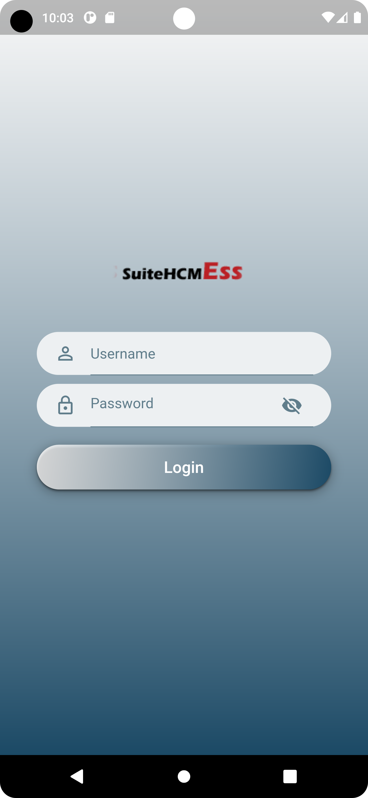
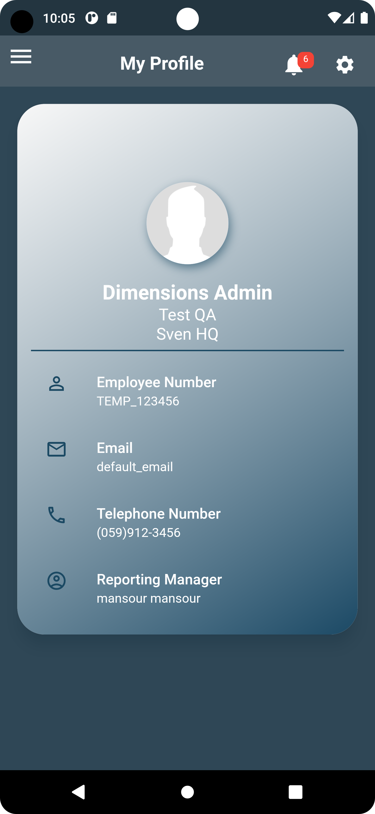

# 🌟 Sven HR Mobile Application 🌟

Welcome to the **Sven HR Mobile Application**. This innovative Flutter-built app is designed to transform the way businesses manage human resources. Efficient, user-friendly, and technologically advanced, our app is a beacon in the realm of HR technology.


## 🚀 Key Features

### 🛡️ **Login and Security**
- Secure login and password management.
- 

### 👤 **Profile and Settings**
- User profile customization and app settings.
- 

### 🌴 **Leave and Vacation Management**
- Managing leaves and vacation planning made easy.
- 

### 💼 **Expense and Work Management**
- Track expenses and manage work requests efficiently.
- 

### 🏦 **Loan and Time Management**
- Loan requests and timesheet management at your fingertips.
- 

### 🌍 **Localization**
- Experience the app in multiple languages.
- 

### 🔔 **Notifications and Approvals**
- Stay updated with real-time notifications.
- 

### ⚠️ **Error Handling**
- A user-friendly interface even during unexpected errors.
- 

## 🛠️ Installation

Get started with the Sven HR Mobile Application:

```bash
git clone https://github.com/yourusername/sven_hr.git
cd sven_hr
flutter run

🧰 Technologies Used
Flutter
Dart
Firebase
🤝 Contributions
We welcome contributions. Feel free to fork the project and submit your pull requests.
📄 License
Distributed under the MIT License
