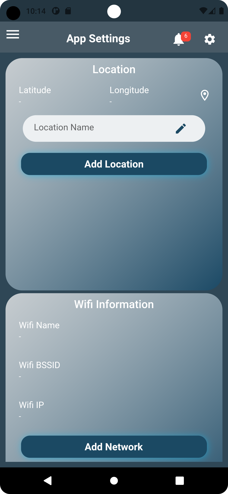

# 🌟 Sven HR Mobile Application 🌟

Welcome to the **Sven HR Mobile Application**. This innovative Flutter-built app is designed to transform the way businesses manage human resources. Efficient, user-friendly, and technologically advanced, our app is a beacon in the realm of HR technology.


## 🚀 Key Features

### 🛡️ **Login and Security**
Securely log in and manage your account with ease.
- 
- 

### 👤 **Profile Management**
Personalize your profile and tailor your settings.
- 
- 

### 🌴 **Leave and Vacation Management**
Effortlessly handle leaves and plan your vacations.
- 
- 
- 

### 💼 **Expense and Extra Work Management**
Keep track of expenses and manage extra work requests with a tap.
- 
- 
- 

### 🏦 **Loan and Time Sheet Management**
Request loans and manage time sheets effortlessly.
- 
- 
- 

### 🌍 Localization and Accessibility
Experience our app in your language.
- 

### 🔔 Notifications and Approvals
Stay updated with real-time notifications and approval workflows.
- 
- 

### ⚠️ Error Handling
User-friendly interface even during unexpected errors.
- 

## 🛠️ Installation

Get started with the Sven HR Mobile Application in a few simple steps:

```bash
git clone https://github.com/yourusername/sven_hr.git
cd sven_hr
flutter run
